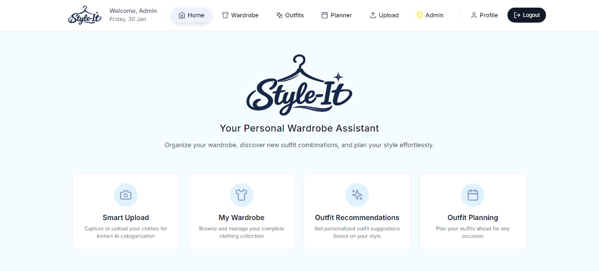
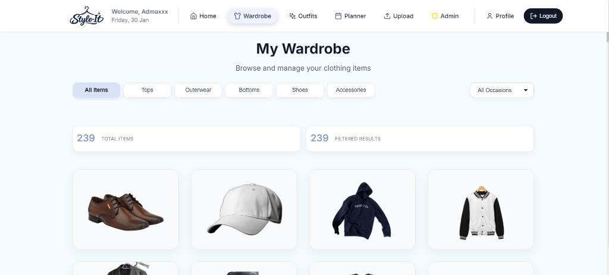
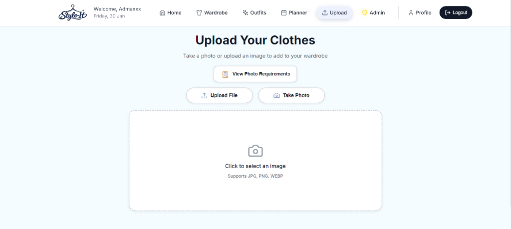
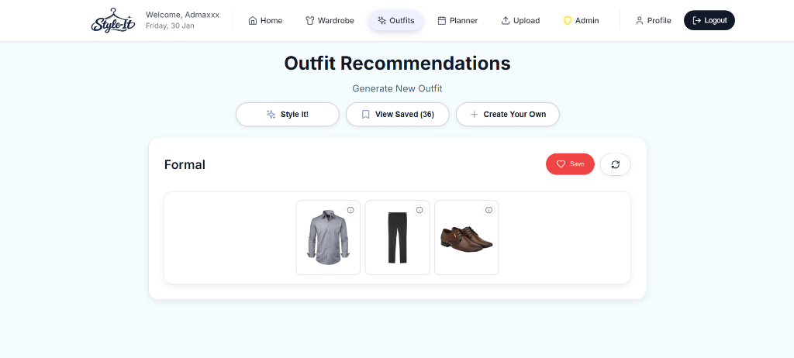
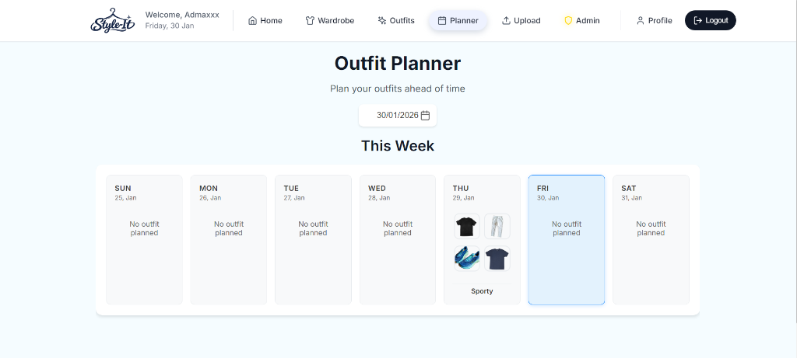
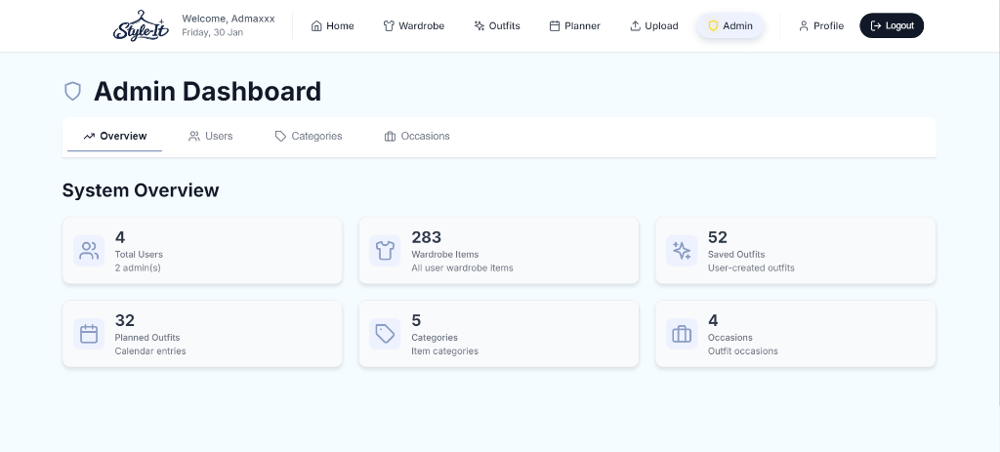
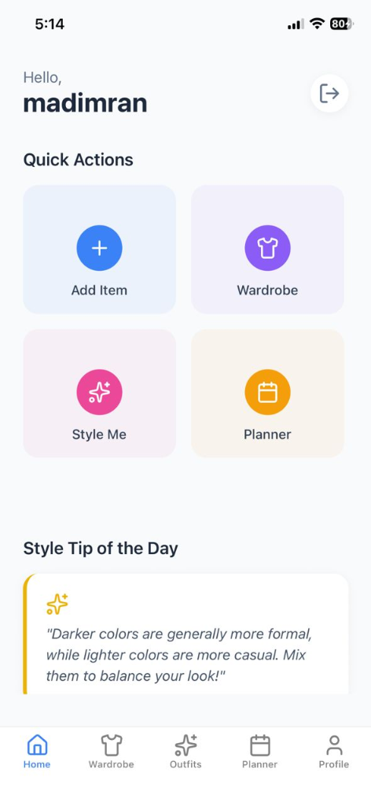
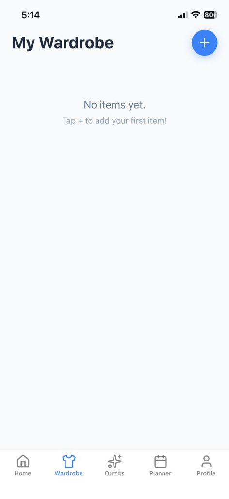

# StyleIt 👗

> [!NOTE]
> **Status: Final Year Project**
> This project was architected and developed as a comprehensive Final Year Project to explore the intersection of Fashion and Artificial Intelligence.

**StyleIt** is a dual-platform intelligent wardrobe management system designed to solve the "wardrobe paralysis" problem. By seamlessly integrating a robust MERN stack web dashboard with a high-performance React Native mobile application, StyleIt digitizes the physical closet, offering AI-powered categorization, automated background removal, and smart outfit coordination.

## 🚀 Overview

In the era of fast fashion, managing a personal wardrobe has become increasingly chaotic. **StyleIt** addresses this by providing a unified digital ecosystem where users can:
- **Digitize**: Instantly catalog clothing items using computer vision.
- **Organize**: Automatically tag and categorize items by color, type, and occasion.
- **Plan**: Schedule outfits for future events using an interactive calendar.
- **Discover**: Receive algorithmically generated outfit suggestions based on style rules.

This project demonstrates full-stack proficiency, combining complex backend image processing with polished, user-centric frontend interfaces on both web and mobile.

## ✨ Key Features

### 🖥️ Web Dashboard (Management Hub)
- **AI-Powered Upload Pipeline**: Uploads are processed via **Google Vision API** for object detection and **Rembg** for automatic background removal, delivering clean, professional product images.
- **Visual Closet**: A responsive grid view of all items with advanced filtering by category (Tops, Bottoms, etc.) and occasion.
- **Outfit Canvas**: A drag-and-drop style interface for manually assembling and saving new outfit combinations.

### 📱 Mobile Application (On-the-Go)
- **Native Experience**: Built with **React Native** & **Expo** for a smooth, fluid iOS/Android experience.
- **Cross-Platform Sync**: Real-time synchronization with the web database ensures your wardrobe is always up to date.
- **Daily Planner**: View and manage scheduled outfits for the week ahead.
- **"Style Me" Mode**: A dedicated feature that uses a rule-based algorithm to generate a complete outfit recommendation for a specific occasion (e.g., "Work", "Date Night").

## � System Architecture & Workflow

The StyleIt ecosystem is built on a **Microservices-inspired** architecture to handle heavy image processing efficiently.

1.  **Image Capture & Ingestion**:
    *   User uploads a raw image via Web or Mobile.
    *   The backend temporarily stores the file and triggers the processing pipeline.

2.  **Intelligent Processing Pipeline**:
    *   **Step A (Background Removal)**: The image is sent to a dedicated Python microservice running `rembg`, which uses U^2-Net to strip the background.
    *   **Step B (Sensing)**: The processed image is analyzed by **Google Vision API** to detect labels (e.g., "Blue Denim Jeans") and dominant colors.

3.  **Data Structuring**:
    *   The node.js backend maps the AI labels to internal categories (e.g., "Jeans" -> "Bottoms").
    *   Metadata (Tags, Occasion, Color) is stored in **MongoDB**.

4.  **User Interaction**:
    *   The Frontend retrieves the structured data, allowing users to view, edit, and use the item in the Outfit Creator.

## 🛠️ Tech Stack

### **Frontend (Web)**
- **Framework**: React.js (v18)
- **Styling**: Tailwind CSS, Styled Components, Framer Motion
- **State Management**: React Context API
- **Routing**: React Router v6

### **Mobile App**
- **Framework**: React Native (Expo SDK 50+)
- **Navigation**: React Navigation (Stack & Bottom Tabs)
- **UI Component**: Custom Design System with Lucide Icons
- **Network**: Axios with Interceptors

### **Backend & DevOps**
- **Runtime**: Node.js & Express.js
- **Database**: MongoDB (Mongoose ODM)
- **AI/ML Services**:
    - **Google Cloud Vision API** (Label Detection)
    - **Python Service** (Rembg/U^2-Net for Background Removal)
- **Authentication**: JWT (JSON Web Tokens) with Bcrypt

## 📸 Screenshots

### Web Interface
<div style="display: flex; gap: 10px; overflow-x: auto; margin-bottom: 20px; padding-bottom: 10px;">
  
  
  
  
  
  
  
</div>

### Mobile Experience
<div style="display: flex; gap: 10px; overflow-x: auto;">
  
  
  
</div>

## 🏁 Getting Started

Follow these instructions to set up the project locally.

### Prerequisites
- Node.js (v16.14.0 or higher)
- Python 3.9+ (for background removal service)
- MongoDB (Running locally or MongoDB Atlas URI)
- Expo Go App (for mobile testing)

### 1. Backend Setup
The backend controls the database and image processing.

```bash
cd backend
npm install

# Create a .env file
# PORT=5000
# MONGO_URI=mongodb://localhost:27017/styleit
# JWT_SECRET=your_secret_key
# GOOGLE_APPLICATION_CREDENTIALS=path/to/key.json

# Start the Node Server
npm start
```

### 2. Python Service Setup (Optional)
Required for background removal feature.

```bash
cd python-service
pip install rembg
flask run --port 5001
```

### 3. Web Frontend Setup
```bash
# Return to root
npm install
npm start
# Opens at http://localhost:3000
```

### 4. Mobile App Setup
```bash
cd mobile
npm install
npx expo start
# Scan the QR code with your phone
```

## 📝 License

This project is open-source and available under the [MIT License](LICENSE).
