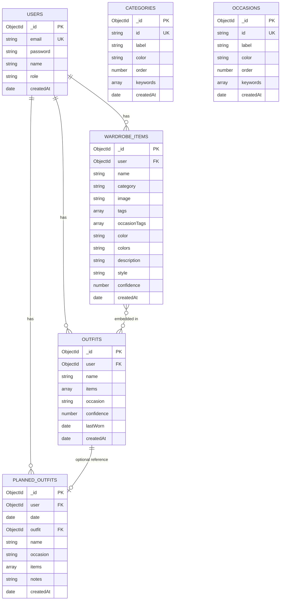

# Entity Relationship Diagram - StyleIt Database

## Mermaid ERD Format

## Relationships Explained

1. **USERS → WARDROBE_ITEMS** (One-to-Many)
   - One user can have many wardrobe items
   - Each wardrobe item belongs to one user

2. **USERS → OUTFITS** (One-to-Many)
   - One user can have many saved outfits
   - Each outfit belongs to one user

3. **USERS → PLANNED_OUTFITS** (One-to-Many)
   - One user can have many planned outfits
   - Each planned outfit belongs to one user

4. **OUTFITS → PLANNED_OUTFITS** (One-to-One, Optional)
   - A planned outfit can optionally reference a saved outfit
   - A saved outfit can be used in multiple planned outfits

5. **WARDROBE_ITEMS ↔ OUTFITS** (Many-to-Many, Embedded)
   - Outfit items are embedded in Outfit documents
   - Items reference WardrobeItem via _id field

6. **CATEGORIES** (Standalone)
   - System-wide categories for AI matching and filtering

7. **OCCASIONS** (Standalone)
   - System-wide occasions for filtering and recommendations

