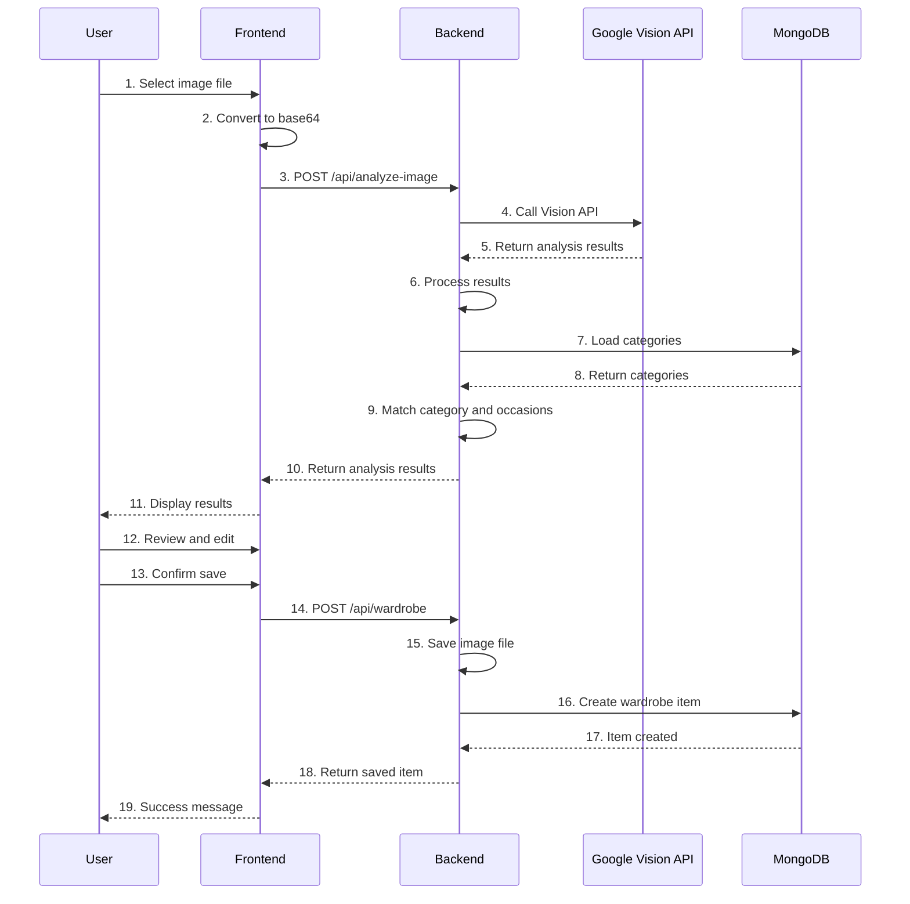

# Mermaid Diagrams for FYP2 Report

These Mermaid diagrams can be used directly in markdown or converted to images.

## 1. System Architecture Diagram

## 2. Entity Relationship Diagram

## 3. User Registration Sequence Diagram

## 4. Image Upload and Analysis Sequence Diagram

## 5. Outfit Recommendation Sequence Diagram

## 6. Calendar Planning Sequence Diagram

## How to Use These Diagrams

### Option 1: Use in Markdown
If your report supports Mermaid (GitHub, some markdown viewers):
- Copy the mermaid code blocks directly into your markdown
- They will render automatically

### Option 2: Convert to Images
1. Go to https://mermaid.live/
2. Paste the mermaid code
3. Export as PNG or SVG
4. Insert into your report

### Option 3: Use in Draw.io
1. Open draw.io
2. Use these as reference
3. Recreate manually for more control
4. Export as PNG or SVG

---

**Note**: Adjust the diagrams based on your actual implementation details.

