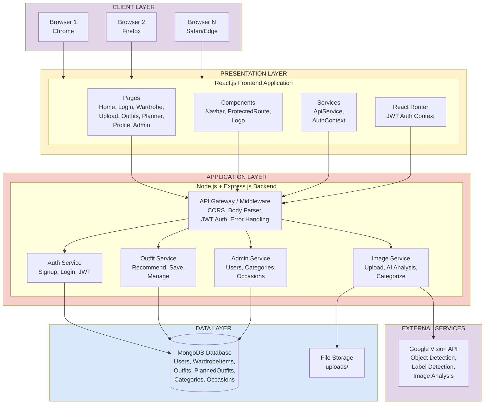

# System Architecture Diagram - StyleIt

## Mermaid Format

## Architecture Layers Description

### CLIENT LAYER
- Multiple web browsers accessing the application
- Standard HTTP/HTTPS communication

### PRESENTATION LAYER
- **React.js Frontend**: Single-page application
- **Pages**: All user-facing pages
- **Components**: Reusable UI components
- **Services**: API communication and authentication
- **Router**: Client-side routing and auth context

### APPLICATION LAYER
- **Express.js Backend**: RESTful API server
- **API Gateway**: Middleware for request handling
- **Auth Service**: User authentication and authorization
- **Image Service**: File upload and AI processing
- **Outfit Service**: Recommendation and outfit management
- **Admin Service**: System administration

### DATA LAYER
- **MongoDB**: Document database storing all data
- **File Storage**: Local storage for uploaded images

### EXTERNAL SERVICES
- **Google Vision API**: AI-powered image analysis

