# Use Case Diagram - StyleIt System

## Mermaid Format

```mermaid
graph TB
    subgraph System["StyleIt System"]
        UC1[Register Account]
        UC2[Login]
        UC3[Upload Clothing Item]
        UC4[View Wardrobe]
        UC5[Edit Item]
        UC6[Delete Item]
        UC7[Filter Items]
        UC8[Get Outfit Recommendation]
        UC9[Save Outfit]
        UC10[Plan Outfit for Date]
        UC11[View Planned Outfits]
        UC12[View Profile]
        UC13[Logout]
        UC14[Manage Categories]
        UC15[Manage Occasions]
        UC16[View Users]
        UC17[View System Statistics]
    end
    
    User((User))
    Admin((Admin))
    
    User --> UC1
    User --> UC2
    User --> UC3
    User --> UC4
    User --> UC5
    User --> UC6
    User --> UC7
    User --> UC8
    User --> UC9
    User --> UC10
    User --> UC11
    User --> UC12
    User --> UC13
    
    Admin --> UC14
    Admin --> UC15
    Admin --> UC16
    Admin --> UC17
    
    UC4 -.include.-> UC5
    UC4 -.include.-> UC6
    UC4 -.include.-> UC7
    UC3 -.extend.-> UC4
    
    style User fill:#e1f5ff
    style Admin fill:#fff4e6
    style UC1 fill:#d5e8d4
    style UC2 fill:#d5e8d4
    style UC3 fill:#d5e8d4
    style UC4 fill:#d5e8d4
    style UC5 fill:#d5e8d4
    style UC6 fill:#d5e8d4
    style UC7 fill:#d5e8d4
    style UC8 fill:#d5e8d4
    style UC9 fill:#d5e8d4
    style UC10 fill:#d5e8d4
    style UC11 fill:#d5e8d4
    style UC12 fill:#d5e8d4
    style UC13 fill:#d5e8d4
    style UC14 fill:#fff2cc
    style UC15 fill:#fff2cc
    style UC16 fill:#fff2cc
    style UC17 fill:#fff2cc
```

## Description

**Actors:**
- **User**: Regular end user of the system
- **Admin**: System administrator with special privileges

**User Use Cases:**
1. Register Account - Create new user account
2. Login - Authenticate and access system
3. Upload Clothing Item - Add items to wardrobe with AI analysis
4. View Wardrobe - Display all wardrobe items
5. Edit Item - Modify item details
6. Delete Item - Remove item from wardrobe
7. Filter Items - Filter by category or occasion
8. Get Outfit Recommendation - Receive outfit suggestions
9. Save Outfit - Save recommended or custom outfits
10. Plan Outfit for Date - Schedule outfits on calendar
11. View Planned Outfits - See planned outfits on calendar
12. View Profile - Access profile and statistics
13. Logout - End session

**Admin Use Cases:**
1. Manage Categories - Create, edit, delete categories
2. Manage Occasions - Create, edit, delete occasions
3. View Users - View all system users
4. View System Statistics - Access system-wide statistics

**Relationships:**
- View Wardrobe includes Edit Item, Delete Item, and Filter Items
- Upload Clothing Item extends to View Wardrobe

